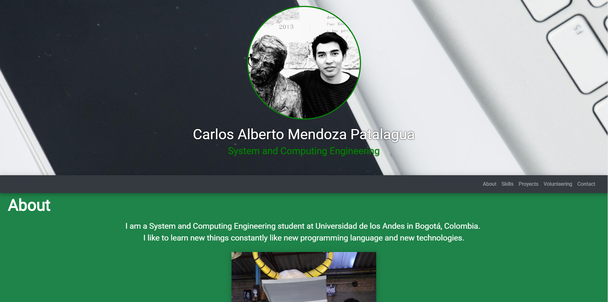

# Carlos Mendoza Personal Web Page
**Objective**  
Create my personal web page to show relevant information about myself and my projects using HTML, CSS and JavaScript.

**How do you run?**  

+ Locally: you can deploy it with a http server
+ Internet connection: you can use the github url: https://carlosmendoza.github.io/PersonalPage/  

**Author**  

Carlos Alberto Mendoza Patalagua  

https://github.com/carlosmendoza/PersonalPage

 
